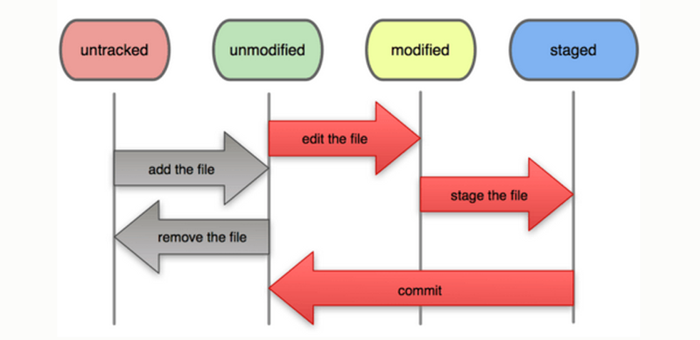

<!--
This file is auto-generated from a 'template.md'
file using the 'md-process' script.
Therefore *DO NOT* edit this file directly!
Instead edit the template file and then run 'md-process'.
-->

# Introduction to Version Control with GIT
(90 minutes)


## Table of Contents

* [Learning Objectives - IWBAT](#learning-objectives---iwbat)
  * [Concepts](#concepts)
  * [Skills](#skills)
* [Why Version Control?](#why-version-control)
  * [Pair & Share](#pair-&-share)
* [What is Version Control?](#what-is-version-control)
* [What is Version Control Good For?](#what-is-version-control-good-for)
  * [What if you could live your life using a Version Control System?](#what-if-you-could-live-your-life-using-a-version-control-system)
* [Code Along](#code-along)
  * [Agenda](#agenda)
  * [Code Along Part 1 - Setup](#code-along-part-1---setup)
  * [Code Along Part 2 - Creating a repo](#code-along-part-2---creating-a-repo)
  * [Code Along Part 3 - Our first commit](#code-along-part-3---our-first-commit)
* [Basic Git Concepts](#basic-git-concepts)
  * [Basic Git Workflow](#basic-git-workflow)
* [File Status Lifecycle](#file-status-lifecycle)
  * [Code Along Part 4 - More commits, viewing the history](#code-along-part-4---more-commits-viewing-the-history)
* [Code Challenge - Make additional changes and commits](#code-challenge---make-additional-changes-and-commits)
  * [Code Along Part 5 - Cherry Picking](#code-along-part-5---cherry-picking)
  * [Code Along Part 6 - Checking out a Previous Version](#code-along-part-6---checking-out-a-previous-version)
  * [Code Along Part 7 - Diffing](#code-along-part-7---diffing)
  * [Code Along Part 8 - Rolling back changes](#code-along-part-8---rolling-back-changes)
* [GIT Terminology](#git-terminology)
* [Review](#review)
* [Quiz](#quiz)
* [GIT Cheatsheet](#git-cheatsheet)

## Learning Objectives - IWBAT
### Concepts
* Explain the purpose of Version Control
* List the problems that Version Control solves
* List the main components of a git repository and how they relate:
    - repository
    - working area
    - index / stage
    - commit
    - head

### Skills
* Create a local git repository
* Add and commit changes to a git repository
* Check the status of a git repository
* View the history of a git repository
* Checkout an old version of the repo

---

## Why Version Control?

### Pair & Share
* Spend a few minutes discussing the following questions:
  Assuming that version control systems do not exist, how would you:
    - Share your source code with other developers?
    - Collaborate with other developers
    - Manage multiple versions of a software product?
        - Free vs. Paid
        - Basic vs. Premium
        - 2.x vs. 3.x

---

## What is Version Control?
* _Version Control_ is the management of changes to documents, computer programs, web sites, and other collections of information.

* _Version Control_ provides:
    - a database containing a history of changes to a set of files
    - a set of commands for managing that database

## What is Version Control Good For?
* Manage Changes Over Time
    - Save various points in the development of your work.
    - See the history of your work.
    - Go "Back In Time" to see previous versions of your work.
    - Manage multiple versions of a software project.
* Sharing & Collaboration
    - Share your work with others.
    - Work effectively as a team on a single project.
    - Allow others to modify your work in a _controlled_ way.
    - Make multiple changes to a project in parallel.
    - Merge parallel changes in a controlled way.
* Experimentation
    - Experiment with various ideas and either keep or discard your experiments.
    - Keep multiple changes isolated until they are ready to be integrated.

### What if you could live your life using a Version Control System?

* Should I go back to school or move to Europe?
* Should I date person X or person Y?
* Should I try to make it big as a professional Rock star?

---

## Code Along
(about 40 minutes)

### Agenda
* Check our GIT configuration
* Develop our GIT Skills
  - Create a Local GIT repo
  - Add files
  - Make commits
  - Check the repo status
  - View history
  - Time travel

### Code Along Part 1 - Setup

Check the GIT Version:

```bash
$ which git
$ git --version
```

If you don't have git installed via brew, you should do so now:

```bash
brew install git            # use brew to install latest version of git
which git                   # should return "/usr/local/bin/git"
```

Check your GIT Config:

```bash
$ git config --list
$ git config user.name
```

Set your identity:

```bash
$ git config --global user.name "John Doe"
$ git config --global user.email johndoe@example.com
```

Set your default editor:

```bash
$ git config --global core.editor "subl -n -w"
```

### Code Along Part 2 - Creating a repo

Create a new local GIT repository:

```bash
$ cd ~/ga/wdi/exercises/learning-git
$ mkdir sample1
$ cd sample1
$ git init
```

* What just happened?
* Did your Shell Prompt change?

### Code Along Part 3 - Our first commit

Add some files:

```bash
$ touch README.md hello.txt
$ git status
# What is an untracked file?

$ git add -A
$ git status
# Now the files are in the stage
```

Commit the changes:

```bash
$ git commit -m "Added 2 files."
$ git status
$ git log
```

---

## Basic Git Concepts

Your Git managed files exist in the following places:

* the __Working Area__
* the __Stage__
* the _local_ Git __Repository__ (.git)
* (optional) a remote Git __Repository__ (such as GitHub)


### Basic Git Workflow


---

## File Status Lifecycle

Files can be _untracked_ or _tracked_.

* _untracked_: Git is not tracking any changes to the file. The file is being _ignored_ by Git.
* _tracked_: Git is tracking changes to the file (Git saves each set of changes in a commit).

A file is moved from an _untracked_ state to a _tracked_ state by adding it to the stage and then _committing_ the stage.



---

### Code Along Part 4 - More commits, viewing the history

Edit hello.txt and commit changes:

```bash
# Modify a file
$ echo "Hello, World" >> hello.txt
$ git status
# We now see a "modified" file, but nothing is staged.

# Let's add our changes to the stage
$ git add .
$ git status

# Now our changes are staged and we can do a commit
$ git commit -m "Fixed hello.txt"

# Let's view the repo history
$ git log

# Notice all of the info in the log
# In what order are the commits displayed?
```

---

## Code Challenge - Make additional changes and commits

* Check your status and history as you go
* Suggested changes:
    - Hello General Assembly
    - Hello WDI
    - Hello GIT

Instructor Demos Solution

### Code Along Part 5 - Cherry Picking

Demo the editing of multiple files but only adding one of them to the stage

```bash
git add file1
git commit
git status
git log
```

### Code Along Part 6 - Checking out a Previous Version

```bash
git log
git checkout <hash_of_previous_commit>
cat hello.txt
# We see the old version

# Let's look at the history
git log
# By default the log command only shows up to the current commit we are on

# Let's see all of the commits
git log --all --decorate
# What is HEAD and master?

# Now let's get back to the most recent version
# We have a few ways to do this:
git checkout master
# or
git checkout <hash_of_most_recent_commit>
```

### Code Along Part 7 - Diffing

```bash
# View unstaged differences
git diff
# or
git diff filename

# View staged differences
git diff --staged
# or
git diff --staged filename
```

### Code Along Part 8 - Rolling back changes

```bash
# unstage changes to a file
git reset filename
git status

# Discarding changes (reverting to the committed version)
git checkout filename
git status
```

---

## GIT Terminology

* **repository** - a collection of related commits that form a directed acyclic graph
* **commit** - a snapshot of the working tree at a giving time (along with a message of what changed)
* **the index (stage)** - a staging area where we list changes we want to commit
* **branch** - a set of commits that form a linear progression of changes
* **master** - the default name for the "main" development branch
* **tag** - an optional label on a commit
* **HEAD** - what is currently checked out
* **working area** - the directory and subdirectories containing the files we are currently working on

---

## Review

* Can someone tell me what a GIT Repository is?
* What are some key components of a GIT repo?
* Can someone describe an important GIT command (get several responses from
  students)

---

## Quiz

1. What is the GIT command for creating a new database from the terminal?

2. When you first edit and save a file, the changes are stored in:
  * a. the stage
  * b. the .git directory
  * c. the working area

3. A GIT commit will include all of the changes that are in the:
  * a. the stage
  * b. the .git directory
  * c. the working area

4. What command would you use to add the changes to the file "hello.txt" to the stage?

5. What GIT command is used to load a previous revision into the working area?

<details>
  <summary><strong>Quiz Answers</strong></summary>
1. init
<br>
2. (c) the working area
<br>
3. (a) the stage
<br>
4. git add hello.txt
<br>
5. checkout
</details>

---

## GIT Cheatsheet


